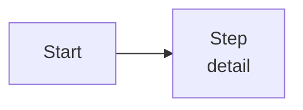

# Day NN — <title>

## Prediction (write before the experiment)
- The number I expect today:

## Concept
<!-- In your own words, as if explaining to the friends group. -->

## Diagram

<!-- Use   for line breaks inside nodes, not \n. -->

## Annotated code
<!-- Paste the key 10–30 lines. Tag each part: [SDK] vendor built-in · [H] my harness · [P] protocol · [T] adopted tool -->

## The number
| Experiment | Setting | Result | vs prediction |
|---|---|---|---|
| | | | |

## Tool verdict (adopt days)
| Question | Answer |
|---|---|
| Can it self-host? Where does the data physically live? | |
| Does it work without its parent framework? | |
| Latency added per turn? | |
| Can its decisions be audited? | |
| Did it move *my* eval? | |

## Leader lens
<!-- Answer the day's leader-lens question in 3–5 sentences. -->

## Didn't land yet
-

## Questions for tomorrow's quiz
1.
2.
3.
4.
5.
