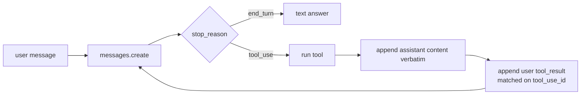

> Drafted by Claude on 2026-09-23 — review and revise before it counts.

# Day 01 — The loop, from tokens up

## Prediction (write before the experiment)
- The number I expect today: not stated before the runs. Do not backfill one.

## Concept
An agent turn is not a chat completion. The model either finishes (`stop_reason: end_turn`) or stops because it wants a tool (`stop_reason: tool_use`). The harness owns `messages`. On a tool stop it executes the call, appends the assistant turn verbatim, then appends one user turn whose `content` is an array of `tool_result` blocks. Each result's `tool_use_id` must be the id inside the `tool_use` block (`toolu_...`), not the message id (`msg_...`). Then it calls again.

The Messages API hides the token string. Qwen's `apply_chat_template` is the missing half: a Jinja template wraps roles in `<|im_start|>` / `<|im_end|>`, dumps tool schemas into the system prompt, and tells the model to emit JSON inside `<tool_call>` tags. A tool result goes back as `role: "tool"`, which the template renders as `<tool_response>`. Anthropic does that wrapping for you. Open models make you do it, or the model never sees a well-formed prompt.

`content` is always an array of blocks. A bare object, a whole `Message`, or a string in the wrong place is a 400.

## Diagram


## Annotated code
The wire shape from `d01_1_raw_call.py`. `[P]` is the protocol. `[H]` is the harness choosing which id to copy.

```python
messages.append({
    "role": "assistant",          # [P] echo the model turn, do not rewrite it
    "content": resp_obj["content"],  # [P] the block array, not the message wrapper
})
messages.append({
    "role": "user",
    "content": [{
        "type": "tool_result",
        "tool_use_id": resp_obj["content"][0]["id"],  # [H] toolu_..., not resp_obj["id"]
        "content": "100.00",
    }],
})
```

The loop in `d01_3_loop.py` is the same shape behind the SDK `[SDK]`, with dispatch still inline `[H]`:

```python
response = client.messages.create(...)          # [SDK]
messages.append({"role": "assistant", "content": response.content})  # [P]
tool_calls = [b for b in response.content if b.type == "tool_use"]
# ... only get_balance appends a tool_result ...
if results:
    messages.append({"role": "user", "content": results})  # [P] one user turn, many results
else:
    return  # unrecognized name: stop, model never sees the failure
```

Qwen side, `d01_2_chat_template.py`: `apply_chat_template(..., tools=tools)` renders the schema `[T]`. `model.generate` returns the prompt plus new tokens; slicing `output_ids[0][input_len:]` keeps only the generation `[H]`. `find_tool_call` still returns the raw JSON string, not `name` and `arguments`.

## The number
| Experiment | Setting | Result | vs prediction |
|---|---|---|---|
| Messages API, turn 1 | claude-haiku-4-5, one `get_balance` tool, raw httpx | 593 input tokens, 59 output tokens, `stop_reason=tool_use` | no prediction |
| Messages API, turn 2 | `tool_result` content `"100.00"`, same `tool_use_id` | 95 input tokens, 21 output tokens, `stop_reason=end_turn`, text answer `$100.00` | no prediction |
| Schema token tax | `apply_chat_template` with tools vs without | not measured | no prediction |

Turn 2's input is 95 tokens because that call did not resend the `tools` array. Turn 1 paid 593 to carry the schema. That gap is not the clean with-vs-without measurement the day asked for; the Qwen render was printed but never counted.

Qwen2.5-0.5B-Instruct, after a made-up tool result of `100.0`, generated: `The balance for the account 1234567890 is currently $100.`

## Tool verdict (adopt days)
Day 1 has no adopt slot. Code-read of mini-swe-agent was the 14:30 block. Nothing was swapped in, so there is no verdict.

## Leader lens
Day 1's question: when a vendor says "we built an agent," which half did they build?

The model half is the weights: they emit `tool_use` or `<tool_call>` and stop. The harness half is everything that makes that useful: owning `messages`, matching `tool_use_id`, executing the tool, returning errors as observations, and refusing to loop forever. Anthropic's API builds the chat-template half for you. It does not build the loop. A demo that returns one tool call and prints the JSON has the model half and a sketch of the harness. The harness is the part a bank would have to defend: what ran, what it was allowed to see, and what happened when it failed.

## Didn't land yet
- No `MAX_TURNS` or `MAX_TOKENS`. The loop is `while True`.
- A raising tool still crashes. It does not come back as `tool_result` with `is_error`.
- An unrecognized tool name returns without telling the model. The assistant `tool_use` is left unmatched.
- The loop never branches on `stop_reason` and never prints the trace line (turn, stop reason, tool names, cumulative tokens).
- `get_balance` returns `random.randint`, not a read of `settings.bank_db_path`. The raw call hard-codes `"100.00"`.
- `find_tool_call` does not parse name and arguments.
- Schema token cost was not written down. `d01_1` prints raw JSON instead of labelled fields.
- `d01_3_loop.py` calls the SDK instead of reusing the raw httpx request. `import os` and `from unittest import result` are unused.
- No evidence in the repo that mini-swe-agent was compared, or that ReAct §1–3 and Toolformer were read.

## Questions for tomorrow's quiz
1. Why must the assistant message be appended verbatim, and which field is the block array?
2. A `tool_result` uses `toolu_...`. What breaks if you pass `msg_...` instead, and where does each id live in the response?
3. `stop_reason` is `tool_use` but the tool name is not one you implement. What has to be in the next user message, and what happens if you omit it?
4. Qwen's chat template and the Messages API both deliver a tool result. What role and wrapper does each one use?
5. Turn 1 cost 593 input tokens and turn 2 cost 95. What did turn 2 stop sending, and why is that not yet the schema-tax number?
